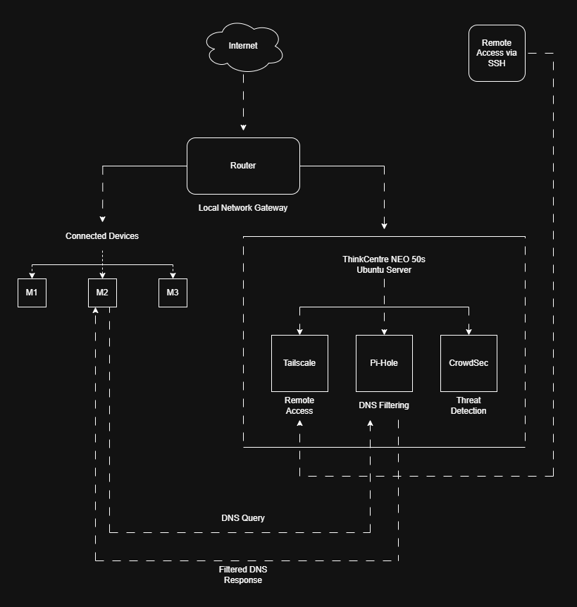
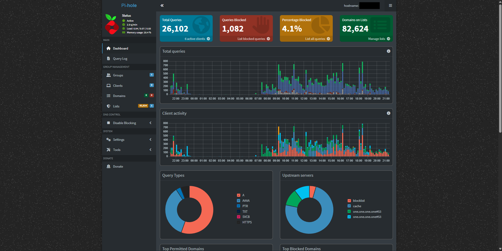
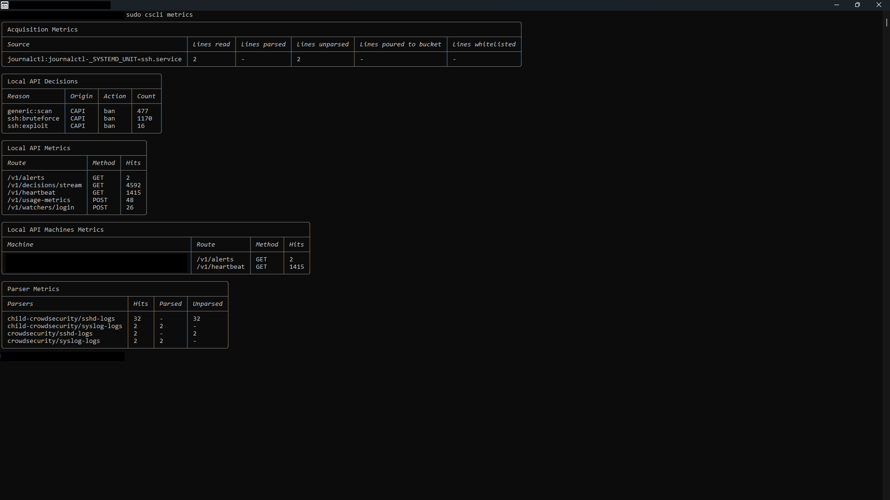
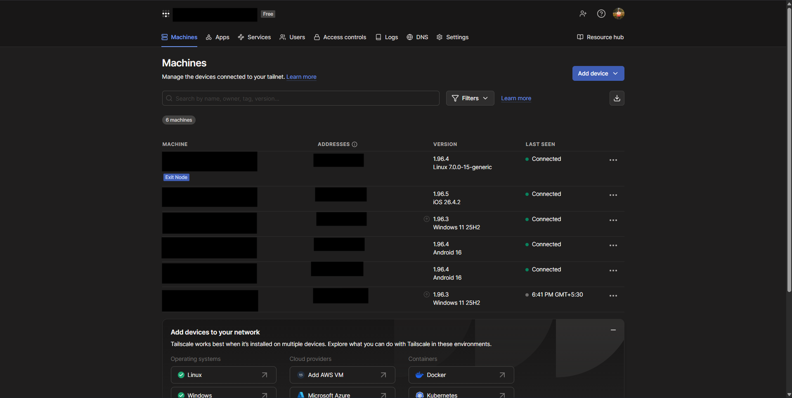

# Secure Homelab Stack

A self-hosted cybersecurity and network security stack running on headless Ubuntu Server using Pi-hole, Tailscale, and CrowdSec

## Overview

This project was built to create a lightweight and secure homelab environment that provides:-

- Network-wide ad and tracker blocking
- Secure remote connectivity
- Threat detection and automated protection
- Centralized security services for connected devices

The stack runs 24/7 on a Lenovo ThinkCentre Neo 50s running Ubuntu Server

---

## Technologies Used:-

- Ubuntu Server
- Tailscale
- Pi-hole
- CrowdSec
- Linux CLI
- SSH
- DNS Filtering
- VPN Networking

---

## Features:-

### Pi-hole
- Network-wide DNS filtering
- Advertisement and tracker blocking
- Reduced unwanted network traffic

### Tailscale
- Secure remote access without port forwarding
- Encrypted mesh VPN connectivity
- Remote administration capability

### CrowdSec
- Community-driven threat intelligence
- Detection of suspicious activity
- Automated blocking and protection

---

## Architecture:-

## Architecture

### Network Overview

This setup routes DNS traffic through Pi-hole for network-wide filtering, uses Tailscale for secure remote administration, and uses CrowdSec for monitoring and threat detection.

---

## Screenshots:-

### Pi-hole Dashboard

The Pi-hole dashboard helped me monitor DNS activity, blocked requests, and overall filtering performance across connected devices inside the homelab environment.

---

### CrowdSec Monitoring

This CrowdSec metrics output shows parser activity, automated decisions, and monitoring statistics collected from the Ubuntu Server environment during testing and regular usage.

---

### Tailscale Network

The Tailscale dashboard was mainly used to manage connected devices, test remote connectivity, and configure access control between administrative and non-administrative systems.
---

## Security Considerations:-

Sensitive information such as
- API keys
- Public IP addresses
- Authentication tokens
- SSH keys

have been removed or sanitized before publishing

---

## Future Improvements:-

Planned improvements include:
- Automated backups for important configurations and data
- Better monitoring and alerting for server health
- Long-term log storage and analysis
- Protection and filtering for more devices
- Adding a local cloud or file-sharing service using Nextcloud or Samba

---

## Learning Outcomes:-

This project helped improve practical skills in:
- Linux server administration
- Networking fundamentals
- DNS infrastructure
- VPN technologies
- Cybersecurity tooling
- Self-hosted infrastructure management

---

## Disclaimer:-

This project is intended for educational and defensive security purposes only
